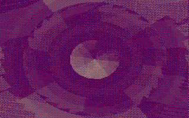

# Tiny demos

I've always loved what smart people can achieve with limited resources. I admire people who code incredible animations, graphics and music in just a few bytes. This repo is simply a listing of links and images to ones I enjoyed most.

## | 8086

**Floorcast** - 32 bytes - HellMood: [[YouTube]](https://www.youtube.com/watch?v=t-l3BQVJnMU) [[Pouet]](https://www.pouet.net/prod.php?which=77774) [[ZIP]](files/floorcast32.zip)

**Projektbeschreibung** - 32 bytes - HellMood: [[Pouet]](https://www.pouet.net/prod.php?which=76788)

**Into a New Era** - 64 bytes - HellMood: [[Pouet]](https://www.pouet.net/prod.php?which=78044)

**Microdose** - 128 bytes - Superogue: [[Pouet]](https://www.pouet.net/prod.php?which=85677) [[YouTube]](https://www.youtube.com/watch?v=-DOqPEBhYxg) [[Writeup]](https://marquee.revival-studios.com/blog/blog_microdose.html)

**Puls** - 256 bytes - Rrroa: [[Pouet]](https://www.pouet.net/prod.php?which=53816)

## | Commodore 64

The following two are sound demos although they both have some sort of graphics its not its strong side.

**A Mind is Born** - 64 bytes - [[YouTube]](https://youtu.be/sWblpsLZ-O8) [[Writeup]](https://linusakesson.net/scene/a-mind-is-born/)

**303-ish sound simultaor** - 303 bytes - [[Twitter post]](https://twitter.com/4mat_scenemusic/status/1234985010588839936)

## | Javascript

**Voltra** - 1024 bytes - Javascript demo. - [[Tumblr post]](https://text-mode.tumblr.com/post/169623546473/voltra-an-audiovisual-treat-in-1-kilobyte-of) [[Writeup]](http://www.p01.org/VOLTRA/) [[YouTube]](https://www.youtube.com/watch?v=WHCpVs-0maU)
